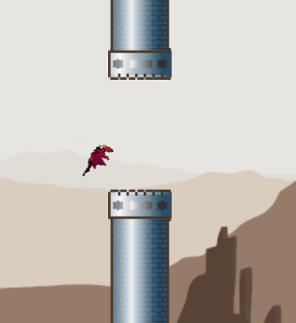
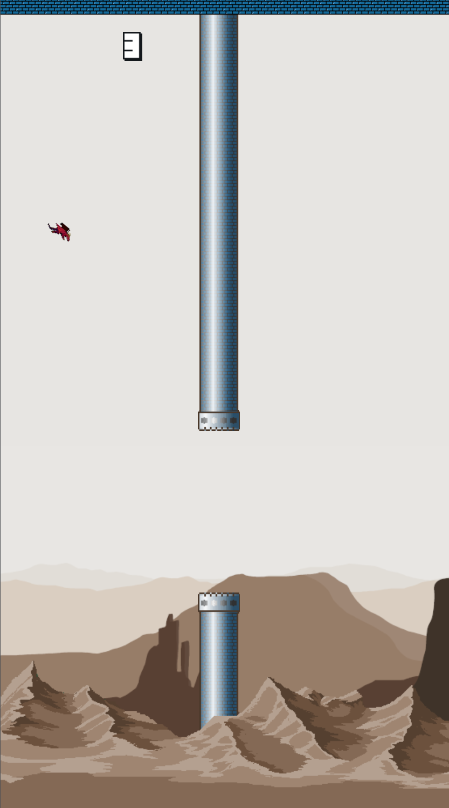

# [Flappy Dragon](http://flappydragon.attim.in/)

Remake of the popular Flappy Bird game with Castle Towers and a flying Dragon.  
以城堡塔楼和飞龙为主题的经典《Flappy Bird》重制版。

Enjoy.尽情享受吧。

Play Original [FlappyDragon](https://flappydragon.attim.in/) 游玩原版
Play Easy Mode [**click**](https://flappydragon.attim.in/?easy) 游玩简单模式
Play Nopipes Mode [**click**](https://flappydragon.attim.in/?nopipes) 游玩无管道模式

Press 'p' to pause and resume :) 按 'p' 键暂停/继续游戏 :)

## 部署说明

首先感谢原作者的开源。[原项目地址](https://github.com/iarunava/flappydragon)

具体汉化了那些内容，请参考[翻译说明](./翻译说明.md)。


有需要帮忙部署这个项目的朋友,一杯奶茶,即可程远程帮你部署，需要可联系。  
微信号 `E-0_0-`  
闲鱼搜索用户 `明月人间`  
或者邮箱 `firfe163@163.com`  
如果这个项目有帮到你。欢迎start。

有其他的项目的汉化需求，欢迎提issue。或其他方式联系通知。

### 镜像

从阿里云或华为云镜像仓库拉取镜像，注意填写镜像标签，镜像仓库中没有`latest`标签

容器内部端口 3000 可通过设置环境变量`SERVER_PORT`的值来指定监听端口

```bash
swr.cn-north-4.myhuaweicloud.com/firfe/flappydragon:2025.05.25
```

### docker run 命令部署

```bash
docker run -d \
--name flappydragon \
--network bridge \
--restart always \
--log-opt max-size=1m \
--log-opt max-file=3 \
-p 3000:3000 \
swr.cn-north-4.myhuaweicloud.com/firfe/flappydragon:2025.05.25
```
### compose 文件部署 👍推荐

```yaml
#version: '3.9'
services:
  flappydragon:
    container_name: flappydragon
    image: swr.cn-north-4.myhuaweicloud.com/firfe/flappydragon:2025.05.25
    network_mode: bridge
    restart: always
    logging:
      options:
        max-size: 1m
        max-file: '3'
    ports:
      - 3000:3000
```

## 修改说明

这里对除了汉化之外的代码修改的说明。  
增加修改部分具体见 [修改说明](./修改说明.md)。

`./README.md` 文件翻译，增加 `## 部署说明`、`## 修改说明`、`## 效果截图` 部分。

增加目录 `./图片`
新增文件 `./.dockerignore`、`./Dockerfile`、`./翻译说明.md`、`./修改说明.md`

## 效果截图




## Credits 致谢
The heavy redesign that has gone in the game is on the assets.  
游戏的大部分改动集中在美术资源上。

A large part of the assets have been drawn by me. And a few taken from opensource art. and then modified for the theme.  
大部分素材由我亲自绘制，少数取自开源素材并针对主题进行了修改。

原始地面 Original Land - [Quantiset](https://opengameart.org/users/quantiset) <br/>
背景 Background - [PWL](https://opengameart.org/users/pwl)
原始飞龙 Original Dragon - [ZaPaper](https://opengameart.org/users/zapaper) <br/>
Original Game concept by Dong Nyugen.游戏原概念由 Dong Nyugen 设计 <br/>
Code based on [nebez's floppybird](https://github.com/nebez/floppybird) 代码基于 nebez 的 floppybird<br/>

All 3 assets which are modified are under CC. If any issue with copyright. Please open an issue.  
所有经过修改的 3 项素材均遵循 CC 协议。如有任何版权问题，请提交 issue。
